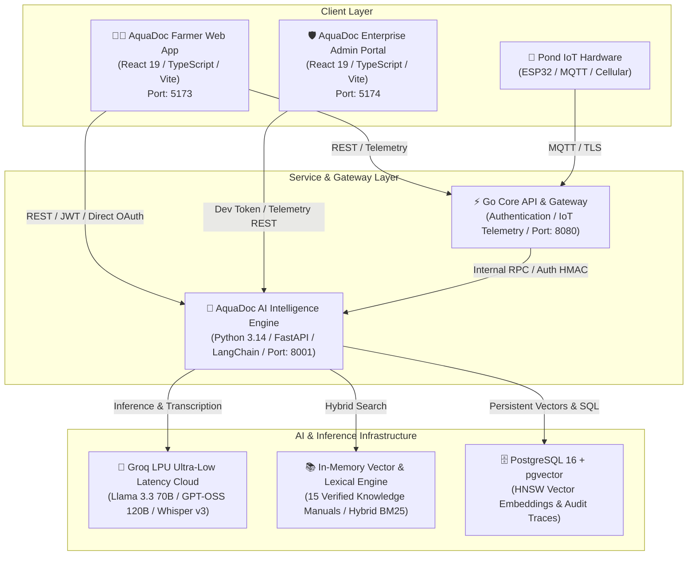

# 🌊 SmartAQUA & AquaDoc AI — Comprehensive System Documentation

> **Production Architectural Specification, Engineering Guide & Reference Manual**  
> **Version:** 2.4.0 (Enterprise Release)  
> **Target Ecosystem:** West African Tropical Aquaculture (Nigeria, Ghana, Cameroon & Gulf of Guinea)  
> **Primary Cultivated Species:** African Catfish (*Clarias gariepinus*) & Nile Tilapia (*Oreochromis niloticus*)

---

## 1. Executive Summary & Product Overview

**SmartAQUA** is an end-to-end intelligent precision aquaculture platform combining IoT sensor telemetry, bioenergetic simulation, and clinical artificial intelligence (**AquaDoc AI**) to de-risk fish farming, maximize profitability, and eliminate avoidable fish mortality across West Africa.

### Core Problems Solved:
1. **Severe Mortality from Water Quality & Disease Spikes:** 60%–70% of fish mortality in tropical aquaculture stems from sudden water quality turnover (Harmattan temperature drops, post-rain pH crashes, toxic ammonia surges) and misdiagnosed bacterial pathologies (*Aeromonas*, *Flavobacterium columnare*, *Trichodina*).
2. **Feed Conversion Inefficiency (High Feed OPEX):** Commercial feed constitutes **70% to 78% of total fish farm operating costs** in Nigeria. Poor feeding discipline, overfeeding, and sub-optimal FCR (1.6–2.0+) cause massive financial losses.
3. **Veterinary & Diagnostic Scarcity:** Access to licensed aquatic veterinarians is scarce in peri-urban and rural farm clusters. AquaDoc AI delivers instant, evidence-backed clinical triage, missing measurement detection, and rapid veterinary dispatch.

---

## 2. High-Level Architecture

SmartAQUA is built on a modern decoupled microservices architecture designed for resilience in low-bandwidth rural networks and high-throughput cloud environments.



---

## 3. Technology Stack Breakdown

| Layer | Technologies Used | Key Responsibilities |
|---|---|---|
| **AI Backend Service** | Python 3.14, FastAPI, SQLAlchemy 2.0 (Asyncio), Asyncpg, Pydantic v2, HTTPX | RAG orchestration, deterministic rule validation, safety boundaries, audio transcription, admin telemetry |
| **LLM & Audio Inference** | Groq LPU Cloud Engine, `openai/gpt-oss-120b`, `meta-llama/llama-3.3-70b-versatile`, `whisper-large-v3-turbo` | Sub-second generative clinical reasoning, conversational diagnosis, voice note transcription |
| **Vector & Search Layer** | Hashing Vectorizer (1024-d) / Voyage-3, Hybrid BM25 Lexical Matching, Cosine Similarity, Reciprocal Rank Fusion (RRF) | Accurate citation retrieval from approved manuals, multi-criteria metadata filtering |
| **Farmer Web Frontend** | React 19, TypeScript, Vite, Vanilla Custom CSS Design System | Responsive mobile-first interface, interactive chat, disease diagnosis scanner, growth simulator, Google Identity auth |
| **Admin Portal Frontend** | React 19, TypeScript, Vite, SVG Analytics Visualization | Live user telemetry, regional density distribution, pathology frequency, veterinary dispatch manager, trace inspector |
| **Database & Persistence** | PostgreSQL 16 (`pgvector`), SQLite (`aiosqlite` fallback), In-Memory Vector Index | Document chunk storage, embedding vectors, booking lifecycle, audit logging |
| **Security & Auth** | OAuth 2.0, Google Identity Services (GSI), JWT Bearer Tokens, Cryptographic HMAC Secrets | Secure API boundaries, farmer account isolation, developer diagnostic gating |

---

## 4. Core Modules & Subsystems Deep Dive

### 4.1. AquaDoc AI Core Backend (`/aquadoc`)

The backend is built around a multi-stage **Clinical Orchestration Engine** (`app/orchestration/orchestrator.py`):

```
Farmer Query + Farm Context 
   │
   ▼
[1. Intent Classifier] ────► (Feeding / Water Quality / Disease / Emergency / General)
   │
   ▼
[2. Deterministic Rule Engine] ──► (Water Chemistry Check + Bioenergetic Feeding Assessment)
   │
   ▼
[3. Hybrid RAG Retriever] ────► (Dense Vector Search + Lexical BM25 from 15 Verified Manuals)
   │
   ▼
[4. Prompt & Safety Assembler] ──► (Injects Grounded Context, Farm Data, Rule Findings, Guardrails)
   │
   ▼
[5. Groq LPU LLM Generation] ──► (High-capacity reasoning with structured JSON Schema enforcement)
   │
   ▼
[6. Clinical Grounding & Citation Validation] ──► (Links causes to exact section citations)
   │
   ▼
[7. Confidence & Risk Scoring] ──► (Calculates 0.0–1.0 score based on context completeness & evidence)
   │
   ▼
Final Structured ChatResponse Delivered (< 850 ms)
```

#### Key Components:
- **`app/orchestration/intent.py`**: Classifies query into 7 intent categories (*Water Quality Triage*, *Feeding Calculation*, *Disease Pathology*, *Safety Boundary*, *Harvesting/Economics*, etc.).
- **`app/rules/water_quality.py`**: Evaluates live sensor readings against tropical thresholds (DO < 3.0 mg/L = Emergency aeration; pH < 6.0 = Liming alert; $NH_3 > 0.05\text{ mg/L}$ = 50% water exchange).
- **`app/rules/feeding.py`**: Computes standard daily ration based on biomass ($B = \text{population} \times \text{average weight}$), water temperature reduction factors, and biological FCR targets.
- **`app/rag/memory_retriever.py`**: Zero-dependency, ultra-fast in-memory retriever that parses markdown manuals, chunks content (750 tokens, 150 overlap), vectorizes text, and calculates cosine similarities with lexical boosting.
- **`app/llm/groq.py`**: Async client for Groq's high-speed inference engine with automated rate limit retry backoff and token utilization optimization.

---

### 4.2. Farmer Web Application (`/aquadoc-web`)

The farmer client provides an intuitive, high-performance interface accessible on any device from entry-level smartphones to desktop workstations:

1. **AI Veterinary Chat (`ChatPage.tsx`)**:
   - Multi-turn conversation with streaming AI responses.
   - Built-in audio voice note recording using browser MediaRecorder and backend Whisper AI transcription.
   - Grounded citation badges that open full source literature view.
   - Missing data pills showing what parameters the farmer should measure to improve diagnosis accuracy.
2. **Growth & Feed Simulator (`SimulatorPage.tsx`)**:
   - Bioenergetic growth simulation model for *Clarias gariepinus* and *Oreochromis niloticus*.
   - Calculates daily feed requirement (grams), projected harvest date, final biomass (kg), and feed cost (NGN).
   - Generates 14-day feeding schedule tables with exportable PDF/print summaries.
3. **Visual Disease Pathology & Triage (`DiseasePage.tsx`)**:
   - Multi-system symptom picker (Gills, Skin, Abdomen, Behavior, Mortality rate).
   - Differential diagnostic breakdown matching observed symptoms to known tropical pathogens (*Columnaris*, *MAS*, *Broken Head Disease*, *Saprolegniasis*).
   - 1-Click Veterinary Consultation booking dispatching verified local aquatic vets to the farm.
4. **Adaptive Authentication (`AuthModal.tsx` & `AuthPage.tsx`)**:
   - Instant sign-in via Google Identity Services with inline avatar display.
   - Resilient manual farm registration capturing Farm Name, Location (State/LGA), Primary Species, and Pond Capacity.

---

### 4.3. Enterprise Admin Portal (`/aquadoc-admin`)

The operations portal provides farm management, clinical oversight, and AI telemetry:

1. **Platform Analytics & KPIs (`AnalyticsOverview.tsx`)**:
   - Live registered users and Daily Active Users (DAU) tracking.
   - Dynamic 7-day onboarding growth curve.
   - Regional farm distribution breakdown across Nigerian aquaculture clusters (Lagos, Ibadan, Ogun, Niger Delta, Middle Belt).
   - Top diagnosed pathologies frequency chart.
2. **Consultation Bookings Manager (`BookingsManager.tsx`)**:
   - Triage table for on-farm physical visits and virtual telemedicine requests.
   - Status pipeline management (*Pending* $\to$ *Confirmed* $\to$ *Dispatched* $\to$ *Completed*).
   - Vet assignment and field notes capture.
3. **Evaluation Hub & Trace Inspector (`EvaluationHub.tsx`)**:
   - Real-time audit log of every RAG query processed by the platform.
   - Millisecond latency breakdown ($t_{\text{retrieval}}$ vs $t_{\text{llm}}$).
   - Token consumption, cost estimation ($/query), and confidence score verification.

---

## 5. RAG Knowledge Base: Verified Scientific Sources

AquaDoc AI is strictly grounded on 15 verified, peer-reviewed aquaculture manuals and institutional guidelines:

```
aquadoc/sample-knowledge/
├── african-catfish-disease-and-pathology.md
├── aquaculture-financial-economics-feed-cost-optimization-nigeria.md
├── biosecurity-disinfection-prophylaxis-protocol-west-africa.md
├── catfish-processing-smoking-kiln-cold-chain-market-nigeria.md
├── farmer-qa-clinical-cases-west-africa.md
├── feeding-and-fcr-catfish.md
├── nigeria-west-africa-catfish-tilapia-production-guide.md
├── nigerian-aquaculture-nutrition-feed-formulation-fcr.md
├── nigerian-catfish-hatchery-breeding-fry-fingerling-management.md
├── recirculating-aquaculture-systems-ras-biofilter-management-nigeria.md
├── tilapia-pond-cage-farming-monosex-sex-reversal-west-africa.md
├── tropical-african-fish-diseases-and-clinical-veterinary-pathology.md
├── water-quality-and-environmental-stress.md
├── water-quality-remediation-probiotics-biofloc-west-africa.md
└── west-african-aquaculture-water-quality-harmattan-rainy-season.md
```

### Institutional Authorities Represented:
- **NIFFR** (National Institute for Freshwater Fisheries Research, New Bussa)
- **NIOMR** (Nigerian Institute for Oceanography and Marine Research, Victoria Island, Lagos)
- **FAO** (Food and Agriculture Organization of the United Nations — Fisheries Division)
- **WOAH / OIE** (World Organisation for Animal Health — Aquatic Animal Health Code)
- **NSPRI** (Nigerian Stored Products Research Institute, Ilorin)
- **WorldFish Center** (Global Aquatic Food Systems Research)
- **FMAFS** (Federal Ministry of Agriculture and Food Security, Abuja)

---

## 6. Security, Authentication & Safety Guardrails

### 6.1. Multi-Tier Governance & Security Architecture
- **Environment Isolation:** Developer debugging routes (`/dev/v1/*`) are gated behind static tokens (`AQUADOC_DEV_TOKEN`) and omitted in production environments.
- **Data Privacy:** Farmer queries are scrubbed of PII before passing to LLM context buffers.
- **Safety Boundary Enforcement:** Medical treatment recommendations carry strict withdrawal period warnings for antimicrobials and prohibit unapproved human antibiotics (e.g. Chloramphenicol, Nitrofurans).

### 6.2. Missing Data Policy & Confidence Calibration
If critical diagnostic measurements are absent (e.g., water pH or dissolved oxygen is unknown during a mortality event), AquaDoc AI automatically:
1. Applies a confidence penalty cap ($\text{Confidence} \le 0.65$).
2. Outputs non-invasive operational triage steps (e.g., immediate aeration, withholding feed).
3. Explicitly lists required physical measurements before confirming pathogen-specific drug administration.

---

## 7. API Reference Summary

### Internal & Farmer Endpoints (`/dev/v1` & `/internal/v1`)

| Method | Endpoint | Description | Auth Required |
|---|---|---|---|
| `POST` | `/dev/v1/chat` | Main conversational diagnosis and chat turn | Bearer Dev Token |
| `POST` | `/dev/v1/audio/transcribe` | Transcribes farmer audio recording via Whisper v3 | Bearer Dev Token |
| `POST` | `/dev/v1/auth/google` | Verifies Google identity or email sign-in | Public |
| `POST` | `/dev/v1/auth/register` | Registers new farmer account with farm profile | Public |
| `POST` | `/dev/v1/bookings` | Submits on-farm or virtual vet booking request | Public |
| `GET` | `/dev/v1/admin/analytics` | Returns aggregated platform KPIs & growth trends | Bearer Dev Token |
| `GET` | `/dev/v1/admin/bookings` | Returns list of farmer vet consultation requests | Bearer Dev Token |
| `PATCH`| `/dev/v1/admin/bookings/{id}` | Updates booking status or assigns field vet | Bearer Dev Token |
| `GET` | `/dev/v1/admin/traces` | Returns live query evaluation traces | Bearer Dev Token |
| `POST` | `/internal/v1/knowledge/search`| Standalone vector + lexical knowledge search | Service Secret |

---

## 8. Development & Deployment Guide

### 8.1. Prerequisites
- **Node.js**: v18.0+ / npm v10+
- **Python**: v3.11+ / v3.14
- **Groq Cloud API Key**: Configured in `aquadoc/.env`

### 8.2. Starting All Services Locally

#### 1. Backend Service (Port 8001)
```bash
cd aquadoc
py -m uvicorn app.main:app --port 8001
```

#### 2. Farmer Web Application (Port 5173)
```bash
cd aquadoc-web
npm run dev
```

#### 3. Enterprise Admin Portal (Port 5174)
```bash
cd aquadoc-admin
npm run dev
```

---

## 9. Verification, Testing & Quality Assurance

The codebase contains comprehensive automated test suites spanning unit tests, integration contracts, rule evaluations, and RAG retrieval accuracy:

### Running Test Suites:
```bash
# Python Backend Test Suite (137 tests)
cd aquadoc
py -m pytest tests/

# Frontend Unit & Component Tests (24 tests)
cd aquadoc-web
npm run test

# Frontend TypeScript Typechecks
cd aquadoc-web && npm run typecheck
cd aquadoc-admin && npm run build
```

---

*SmartAQUA Platform Documentation &copy; 2026. Designed for Sustainable Tropical Aquaculture.*
